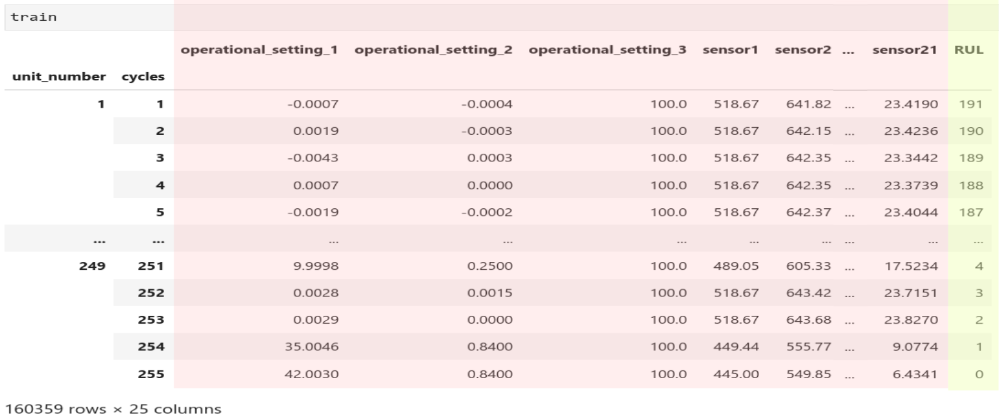
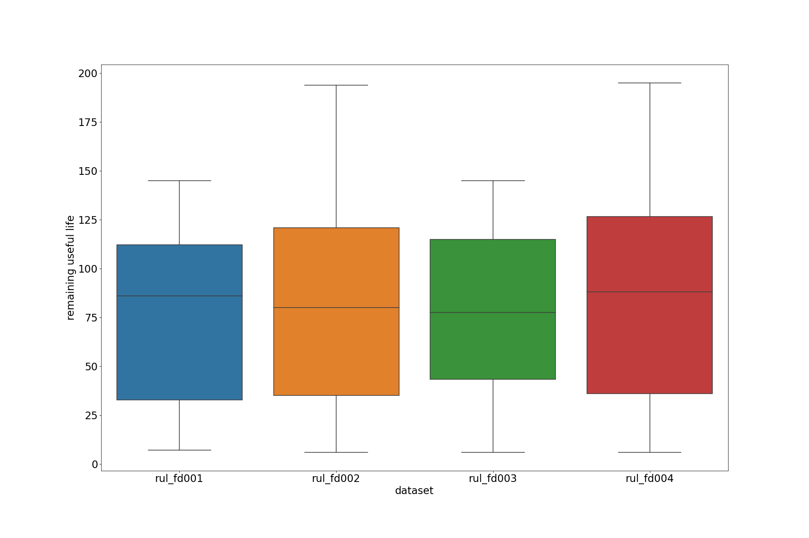
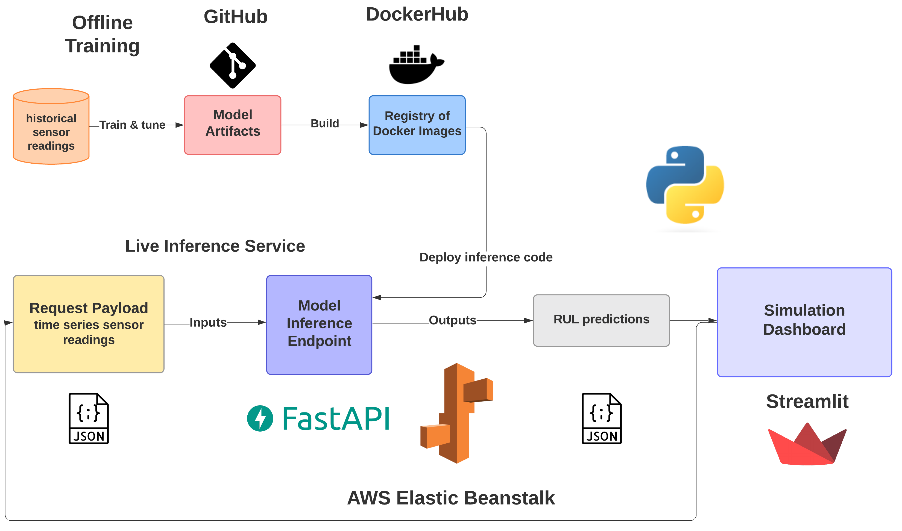
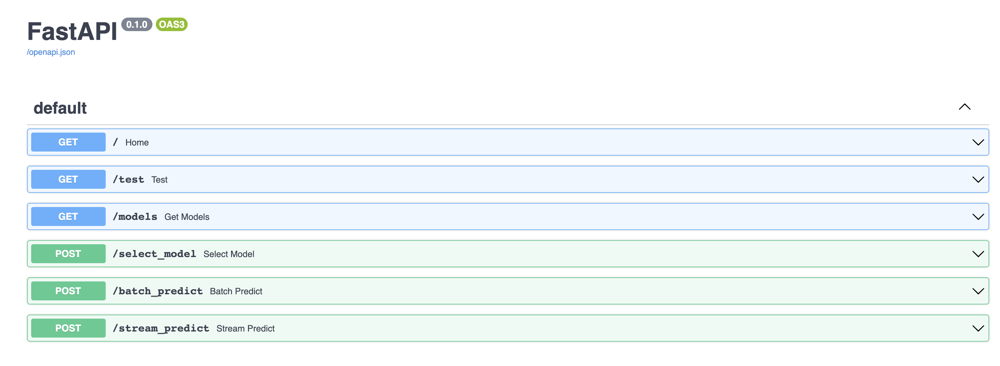
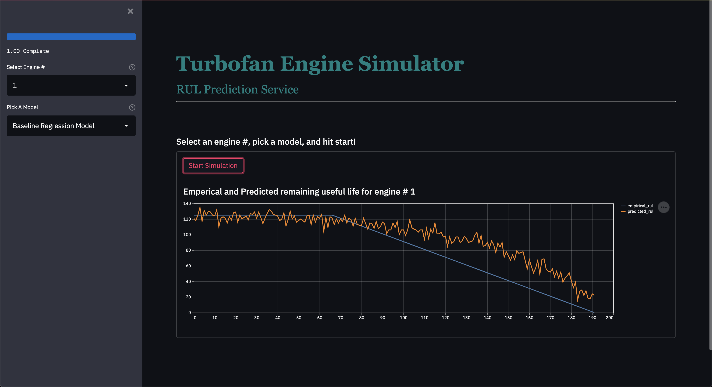
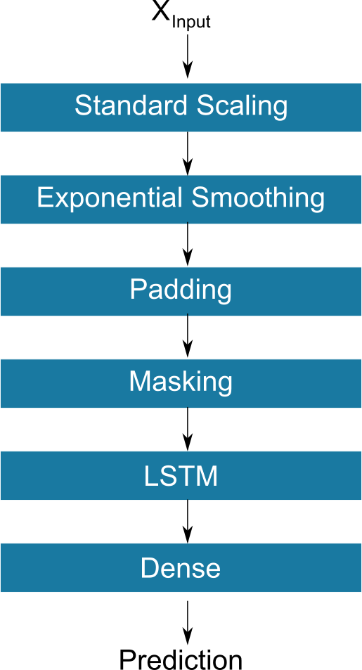
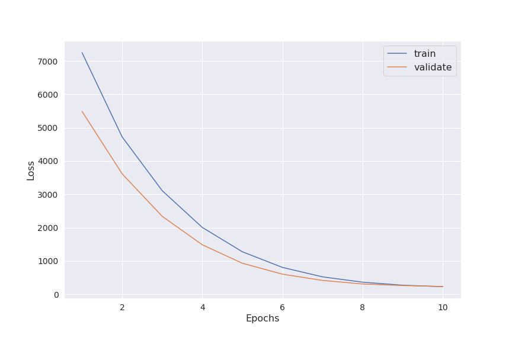

# Turbofan Prognostics Final Model Report

_Report describing the final model to be delivered - typically comprised of one or more of the models built during the life of the project_

## Introduction
Industrial equipment such as Turbofan Engines in aircrafts have very tight and costly maintenance schedules to ensure availability and reliability. It is estimated that 15-70% of total production costs originate from maintenance activities1. Companies are beginning to utilize large streams of sensor data for Prognostics and Predictive Maintenance. Prognostics is the monitoring of the health of a product and predicting its Remaining Useful Life (RUL). Health is defined as the deviation from ideal equipment vitals and conditions usually measured by sensors. Predictive Maintenance are the statistical and computational techniques utilized for detecting defects and failure. Savings from optimizing the use of equipment can lead to $30B of savings in the aviation sector2. The goal of this project was to utilize NASA's CMAPPS data set for building a service that can predict RUL for turbofan engines and also simulating how a model inference service could be utilized on-demand by other software systems in a production setting. Predicting RUL accurately has major industrial implications such as minimizing the number of unexpected breakdowns, maximizing uptime of aircrafts, reducing operational costs by performing only necessary maintenance, and maximizing production hours.

## Analytic Approach

The expected value to be gained from this project lies in effective predictive maintenance of turbofan engines. To explain the analytical approach taken, we  first describe the experimental scenario, as outlined in the NASA's turbofan engine degradation simulation dataset (CMAPSS). The project leverages four (4) multivariate time series (see the Data Schema section for details). FD001 has a single fault mode (HPC Degradation) with 100 vector valued training examples and 100 vector valued test examples. FD002 has single fault mode (HPC Degradation) with 260 training examples and 259 training examples.  FD003 is a more complicated dataset with the possibility of two (2) fault modes (HPC Degradation and or Fan Degradation). For FD003, we had 100 vector valued training examples and 100 vector valued test set examples.  Similar to FD003, FD004 also had two fault modes (HPC Degradation and Fan Degradation) with 248 training examples and 249 test examples. The table below provides a summary of the project training and testing data sets. 

| **Dataset**  | **Fault modes**                 |**Training set size** |**Test set size** |
|--------------|---------------------------------|----------------------|------------------|
|FD001         |HPC Degradation                  |100                   |100               |
|FD002         |HPC Degradation                  |260                   |259               |
|FD003         |HPC Degradation/Fan Degradation  |100                   |100               |
|FD004         |HPC Degradation/Fan Degradation  |248                   |249               |

For the training data, the ultimate demise of the fleet engine will be due to some combination to two plausible failure modes (HPC Degradation and/or Fan Degradation). For the test set, the time series provided terminates at a point in time prior to fleet engine failure, and, the objective of the investigation is to predict this time of failure. To facilitate this prediction, we are provided a vector of ground truth **Remaining Useful life (RUL)** values as our test set **target value**.

The table below illustrates the nature of the training set data. The vector value inputs consists of three (3) operational settings and twenty one (21) sensor values. Unlike the test, no ground truth labels are known for the remaining useful life. As a consequence, the base assumption made here is that there were no remaining useful life at the conclusion of the final cycle, and further, the remaining useful life decrease linearly for each engine cycle. The dataset is then indexed by engine unit number and engine operational cycle.

The boxplots below illustrates the distribution of the ground truth RULs for the test datasets. There is significant RUL variance across the four (4) provided datasets. Consider, for example, the FD002 test dataset. It has a median RUL of 80 cycles and the middle fifty percent ranges from 32 to 122. We keep this distribution of test RULs under consideration as we think about model performance.

For the modeling approach, we treat this challenge as a regression problem aiming to predict the RUL from these vector values input data. In particular, three (3) types of regression models are constructed and compared using the RMSE performance metric. These regression models include:

1. Baseline regression model
2. Time series with distributed lag variables
3. Long short term memory (LSTM) recurrent neural model

Based on a comparison of the RMSE score, the LSTM model is the best performing model (see the Result section for an explanation of this choice). The Feature section provides a discussion of the features and differences in derived features used by these models.

## Solution Description
### System Architecture

Our system architecture for this project included **offline model training**, **a backend model inference service** and a **frontend simulation** of the model inference service.

### Offline Training
The **offline training** portion of our project was in a separate repository in our [Git Organziation](https://github.com/TurbofanPrognostics) called [`turbofan_prognostics`](https://github.com/TurbofanPrognostics/turbofan_prognostics). This repository holds a dockerized Jupyter server that can be run on any machine with all the dependencies installed for the models that were iterated on and saved in the repository. If a new library was necessary, it is as simple as adding that library in the `requirements.txt` file and just rebuilding the docker image. Instructions for building and running the dockerized Jupyter server are in the repository's `README.md`. Models and modeling pipelines that were ready to be deployed were save in binary format (pickle) in the `/models` directory. Having the Jupyter server dockerized made it easier to track which version of each library is utilized during training and deployment.

### Model Inference Service
The modeling service is built utilizing the FastAPI Python framework and can be found in the repository (`turbo_fast_app`)[https://github.com/TurbofanPrognostics/turbo_fast_app]. This service is also dockerized and instructions for building and running this modeling service in a docker container can be found in the README.md file in the repository. This modeling service functions as an on-demand prediction engine that can be utilized by other applications in a microservice oriented architecture. Any application that needs RUL predictions in near real-time can send a post API request to the modeling service with the time series data in the payload and the service will process the request and send back its RUL predictions in the response. FastAPI has a couple of advantages compared to other backend frameworks in Python including automatic schema validation of API requests utilizing the Pydantic library, automatic Swagger documentation where the endpoints are well defined and can be tested and its performance compares with the speed of services written in Go making it great for machine learning projects. FastAPI also has great documentation to get started making it great for newcomers to backend web development.

**Swagger Page**

The model inference service has **6 endpoints** as shown above. 
1. A `GET` request on the `/` endpoint prints out 'hello world' as quick indicator that the service is up and running
2. A `POST` request on the `/test` endpoint is just for testing purposes only. It automatically loads a test JSON request directly from the repository and makes predictions on it
3. A `GET` request on the `/models` endpoint will show a list of the deployed models that can be utilized for live inference
4. A `POST` request on the `/batch_predict` endpoint will return RUL predictions on an entire batch of engines (multiple engines and their time series data)
5. A `POST` request on `/stream_predict` will take in a single engine's time step data and return an RUL prediction for that specific time step
6. A `POST` request on the `/select_model` with a model specified in the list of models returned from the `GET` on `/models` endpoint will load that specified model binary in the backend so that model will be utilized for inference on subsequent requests to `/stream_predict` and `/batch_predict`.

### Streamlit Simulation

This project uses Streamlit to simulate the use of the model inference service. You can select a model for inference in the drop down on the right. Once that is selected, it utilizes the '/select_model' endpoint to actually load that model binary in the model inference service backend. When you hit `Start Simulation`, Streamlit loads training data and begins making requests to the model inference service and plots the predicted RUL at each time step. For the `Baseline Regression Model`, it iterates through each time step and makes a `POST` request to the `/stream_predict` endpoint and streamlit receives the RUL predictions and displays it on a line chart. As the simulation progresses, the predicted RUL and the empirical RUL are plotted on the line chart. The simulation shows the actual empirical RUL that the machine learning model needs to learn and it subsequently also displays the function that the model actually did learn from the training data by plotting the service's predict RULs. This simulation shows how the model inference service could be utilized for near real-time. The simulation actually adds a 0.05 second lag so that the points don't plot too fast for the display or else it seems like a static plot. 

If you pick the `Time Series Model`, it actually utilizes the `/batch_predict` endpoint instead for its simulation. Since the `Time Series Model` has lagged variables, we would have needed to adjust the JSON schema if the similation were to utilize the `/stream_predict` endpoint. We decided not to utilize this approach for this `Time Series Model` and instead utilize the `/batch_predict` endpoint so that we are not coupling JSON schemas to the actual model that is being utilized. In an actual production setting, it may actually make sense to change the JSON schema to accept the parameters necessary for that model.

### Deployment
This project utilizes AWS Elastic Beanstalk for deployment for both the model inference service (FastAPI) and the Streamlit simulation application. Both docker images for the model inference service and Streamlit simulation application were on DockerHub for easier deployment with Elastic Beanstalk. We chose Elastic Beanstalk for its ease of use and scalability on AWS which is by far the most popular cloud. For instructions on how to deploy our applications on Elastic Beanstalk, refer to the README.md for both the [`turbo_fast_app`](https://github.com/TurbofanPrognostics/turbo_fast_app) repository and the [`turbofan-dashboard`](https://github.com/TurbofanPrognostics/turbofan-dashboard) repository.

## Data and Features

The reference for the data sets used in this project is Damage Propagation Modeling for Aircraft Engine Run-to-Failure Simulation published in the 1st International Conference on Prognostics and Health Management. The first use case for this data was to use expert knowledge, combined with the data sets to model damage propagation from which an overall health index can be derived. Thresholding on the health index can then be used to determine failure times.  For our purposes we take a data driven approach to directly predict the remaining useful life of the fleet engines.

Below is a Pydantic schema for the raw features used in the analysis.

	unit_number: int
	time: int
	op_setting_1: float
	op_setting_2: float
	op_setting_3: float
	sensor_1: float
	sensor_2: float
	sensor_3: float
	sensor_4: float
	sensor_5: float
	sensor_6: float
	sensor_7: float
	sensor_8: float
	sensor_9: float
	sensor_10: float
	sensor_11: float
	sensor_12: float
	sensor_13: float
	sensor_14: float
	sensor_15: float
	sensor_16: float
	sensor_17: float
	sensor_18: float
	sensor_19: float
	sensor_20: float
	sensor_21: float
	sensor_22: Optional[float]
	sensor_23: Optional[float]

The unit_number feature is provided as an index used to identify a particular engine within the study. The time feature represents the number of operational cycles a particular engine has experienced. The three (3) op_setting features are used to determine the operational conditions under which the experiment is being performed. The twenty three (23) sensor features are time series of physical sensor measurements.

The summary of the project training and testing data sets provides an overview of the count of units in a particular data set.  When considering each cycle for each unit as the exchangeable data element, the counts of data examples within the project are provided below.

| **Dataset**  |**Training set size**   |**Test set size** |
|--------------|------------------------|------------------|
|FD001         |20631                   |13096             |
|FD002         |53759                   |33991             |
|FD003         |24720                   |16596             |
|FD004         |61249                   |41214             |

## Algorithm

The above figure is a stylized data flow diagram for the LSTM model.  In this report we will only present the data flow diagram for the LSTM model as it is the most accurate model, as well as, the most complex model of the three model under consideration. 

**[Standard Scaling]** Without any preprocessing, the expected Xinput into the LSTM model is expected to be in the form identified by the Pydantic Schema. To prepare the input for model consumption, we first apply a standard scaling. Most of the inputs represents physical measurements, such as sensor temperature or pressure, there is no obvious reasons why a change in scale would impact model performance. As a consequence, we chose to leverage standard scaling to improve convergence stability in the deep neural network architecture.

**[Exponential Smoothing]** The next step in the data flow preprocessing is the application of exponential smoothing to improve the signal to noise ratio of the model features.  Exponential smoothing is a widely used technique that acts as a low pass filter to remove high frequency noise.

**[LSTM into Dense layer]** 
An LSTM model was chosen as one potential model due their potential advantages over traditional approaches. When compared to the baseline model, LSTMs offer the ability to include non-linear relationships between the input and target variables. When compared to the time series model, LSTMs offer the ability to forgo the specification of the number of lag observations required as input. For this particular data flow, we utilize a many to one LSTM architecture (see diagram below) with standard scaling and Exponential smoothing utilized as pre-processing steps to prepare the time series input for use into the single LSTM layer. The output of the LSTM layer is then fed into a Dense layer before generating model predictions. 

## Results

The above diagram illustrates the training/validation loss observed for the FD003 data set. For the ten (10) epochs of model training, similar patterns in loss reductions were observed for the other three data sets (not shown here). Based on these observations we conclude that the utilized data flow procedures along with the LSTM model parameters resulted in converged model. Further, no over fitting to the training data set is indicated from the model loss plot.  

In terms of deciding on model performance, we rely on the root mean square error (RMSE) of the predicted remaining useful life. In the table below we present the MSE for the three experimental models across all four data sets. In terms of both model complexity and model performance, we observe an ordering of **LSTM > Time series > Baseline linear regression** across all four data sets. Further, when we consider the distribution of test RUL (provided in the Analytical approach section), we can conclude that the LSTM model provides acceptable model performance. As an example, the FD003 had a median RUL of 77.5 with an interquartile range of 71.75. The corresponding RMSE for the FD003 model is 18.34 cycles which represents a 68 percent improvement in model performance over the baseline linear regression model. We suggest that this represents good overall model performance, but recognize that such determination ultimately requires business context (not provided here).  

| **Model**               |**Dataset** |**RMSE (cycles)** |**R2**  |**RMSE model improvement (%)**|
|-------------------------|------------|:----------------:|--------|:----------------------------:|
|Base (Linear Regression) |FD001       |31.62             |0.42    | -                            |
|                         |FD002       |34.40             |0.59    | -                            |
|                         |FD003       |57.47             |-0.93   | -                            |
|                         |FD004       |53.84             |0.02    | -                            |
|Timeseries               |FD001       |21.76             |0.73    | 31                           |
|                         |FD002       |32.00             |0.65    | 7                            |
|                         |FD003       |22.53             |0.70    | 31.7                         |
|                         |FD004       |39.27             |0.48    | 27                           |
|LSTM                     |FD001       |17.28             |0.83    | 45                           |
|                         |FD002       |28.22             |0.72    | 18                           |
|                         |FD003       |18.34             |0.80    | 68                           |
|                         |FD004       |27.37             |0.75    | 49                           |

## Future Work
A new CMAPPS data set was released with much larger amounts of data that could be utilized to further test the performance of our models as well as iterate and build new models. Our system did not include any production grade CI/CD pipeline. Deployments to AWS Elastic Beanstalk was done manually through commandline for each service so that is one area of future work that could be iterated on further. We also ran out of cycles to actually deploy the trained LSTM model to our model inference service which is another area we plan on developing.

## References
1. https://arxiv.org/abs/2002.08224
2. https://arxiv.org/pdf/1709.06669.pdf
