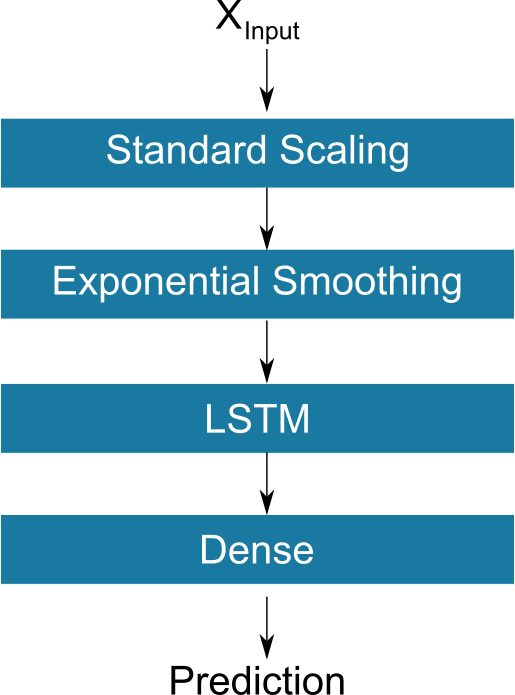

# Turbofan Prognostics Final Model Report

_Report describing the final model to be delivered - typically comprised of one or more of the models built during the life of the project_

## Analytic Approach

The expected value to be gained from this project lies in effective predictive maintenance of turbofan engines. To explain the analytical approach taken, we  first describe the experimental scenario, as outlined in the NASA's turbofan engine degradation simulation dataset (CMAPSS). The project leverages four (4) multivariate time series (see the Data Schema section for details). FD001 has a single fault mode (HPC Degradation) with 100 vector valued training examples and 100 vector valued test examples. FD002 has single fault mode (HPC Degradation) with 260 training examples and 259 training examples.  FD003 is a more complicated dataset with the possibility of two (2) fault modes (HPC Degradation and or Fan Degradation). For FD003, we had 100 vector valued training examples and 100 vector valued test set examples.  Similar to FD003, FD004 also had two fault modes (HPC Degradation and Fan Degradation) with 248 training examples and 249 test examples. The table below provides a summary of the project training and testing data sets. 

| **Dataset**  | **Fault modes**                 |**Training set size** |**Test set size** |
|--------------|---------------------------------|----------------------|------------------|
|FD001         |HPC Degradation                  |100                   |100               |
|FD002         |HPC Degradation                  |260                   |259               |
|FD003         |HPC Degradation/Fan Degradation  |100                   |100               |
|FD004         |HPC Degradation/Fan Degradation  |248                   |249               |

For the training data, the ultimate demise of the fleet engine will be due to some combination to two plausible failure modes (HPC Degradation and/or Fan Degradation). For the test set, the time series provided terminates at a point in time prior to fleet engine failure, and, the objective of the investigation is to predict this time of failure. To facilitate this prediction, we are provided a vector of ground truth **Remaining Useful life (RUL)** values as our test set **target value**.

The table below illustrates the nature of the training set data. The vector value inputs consists of three (3) operational settings and twenty one (21) sensor values. Unlike the test, no ground truth labels are known for the remaining useful life. As a consequence, the base assumption made here is that there were no remaining useful life at the conclusion of the final cycle, and further, the remaining useful life decrease linearly for each engine cycle. The dataset is then indexed by engine unit number and engine operational cycle.

The boxplots below illustrates the distribution of the ground truth RULs for the test datasets. There is significant RUL variance across the four (4) provided datasets. Consider, for example, the FD002 test dataset. It has a median RUL of 80 cycles and the middle fifty percent ranges from 32 to 122. We keep this distribution of test RULs under consideration as we think about model performance.

For the modeling approach, we treat this challenge as a regression problem aiming to predict the RUL from these vector values input data. In particular, three (3) types of regression models are constructed and compared using the RMSE performance metric. These regression models include:

1. Baseline regression model
2. Time series with distributed lag variables
3. Long short term memory (LSTM) recurrent neural model

Based on a comparison of the RMSE score, the LSTM model is the best performing model (see the Result section for an explanation of this choice). The Feature section provides a discussion of the features and differences in derived features used by these models.

## Solution Description
### System Architecture

* Simple solution architecture (Data sources, solution components, data flow)
* What is output?

## Data and Features

The reference for the data sets used in this project is Damage Propagation Modeling for Aircraft Engine Run-to-Failure Simulation published in the 1st International Conference on Prognostics and Health Management. The first use case for this data was to use expert knowledge, combined with the data sets to model damage propagation from which an overall health index can be derived. Thresholding on the health index can then be used to determine failure times.  For our purposes we take a data driven approach to directly predict the remaining useful life of the fleet engines.

Below is a Pydantic schema for the raw features used in the analysis.

	unit_number: int
	time: int
	op_setting_1: float
	op_setting_2: float
	op_setting_3: float
	sensor_1: float
	sensor_2: float
	sensor_3: float
	sensor_4: float
	sensor_5: float
	sensor_6: float
	sensor_7: float
	sensor_8: float
	sensor_9: float
	sensor_10: float
	sensor_11: float
	sensor_12: float
	sensor_13: float
	sensor_14: float
	sensor_15: float
	sensor_16: float
	sensor_17: float
	sensor_18: float
	sensor_19: float
	sensor_20: float
	sensor_21: float
	sensor_22: Optional[float]
	sensor_23: Optional[float]

The unit_number feature is provided as an index used to identify a particular engine within the study. The time feature represents the number of operational cycles a particular engine has experienced. The three (3) op_setting features are used to determine the operational conditions under which the experiment is being performed. The twenty three (23) sensor features are time series of physical sensor measurements.

The summary of the project training and testing data sets provides an overview of the count of units in a particular data set.  When considering each cycle for each unit as the exchangeable data element, the counts of data examples within the project are provided below.

| **Dataset**  |**Training set size**   |**Test set size** |
|--------------|------------------------|------------------|
|FD001         |20631                   |13096             |
|FD002         |53759                   |33991             |
|FD003         |24720                   |16596             |
|FD004         |61249                   |41214             |

## Algorithm

The above figure is a stylized data flow diagram for the LSTM model.  In this report we will only present the data flow diagram for the LSTM model as it is the most accurate model, as well as, the most complex model of the three model under consideration. 

**[Standard Scaling]** Without any preprocessing, the expected Xinput into the LSTM model is expected to be in the form identified by the Pydantic Schema. To prepare the input for model consumption, we first apply a standard scaling. Most of the inputs represents physical measurements, such as sensor temperature or pressure, there is no obvious reasons why a change in scale would impact model performance. As a consequence, we chose to leverage standard scaling to improve convergence stability in the deep neural network architecture.

**[Exponential Smoothing]** The next step in the data flow preprocessing is the application of exponential smoothing to improve the signal to noise ratio of the model features.  Exponential smoothing is a widely used technique that acts as a low pass filter to remove high frequency noise.

**[LSTM into Dense layer]** 
An LSTM model was chosen as one potential model due their potential advantages over traditional approaches. When compared to the baseline model, LSTMs offer the ability to include non-linear relationships between the input and target variables. When compared to the time series model, LSTMs offer the ability to forgo the specification of the number of lag observations required as input. For this particular data flow, we utilize a many to one LSTM architecture (see diagram below) with standard scaling and Exponential smoothing utilized as pre-processing steps to prepare the time series input for use into the single LSTM layer. The output of the LSTM layer is then fed into a Dense layer before generating model predictions. 

## Results

The above diagram illustrates the training/validation loss observed for the FD003 data set. For the ten (10) epochs of model training, similar patterns in loss reductions were observed for the other three data sets (not shown here). Based on these observations we conclude that the utilized data flow procedures along with the LSTM model parameters resulted in converged model. Further, no over fitting to the training data set is indicated from the model loss plot.  

In terms of deciding on model performance, we rely on the root mean square error (RMSE) of the predicted remaining useful life. In the table below we present the MSE for the three experimental models across all four data sets. In terms of both model complexity and model performance, we observe an ordering of **LSTM > Time series > Baseline linear regression** across all four data sets. Further, when we consider the distribution of test RUL (provided in the Analytical approach section), we can conclude that the LSTM model provides acceptable model performance. As an example, the FD003 had a median RUL of 77.5 with an interquartile range of 71.75. The corresponding RMSE for the FD003 model is 18.34 cycles which represents a 68 percent improvement in model performance over the baseline linear regression model. We suggest that this represents good overall model performance, but recognize that such determination ultimately requires business context (not provided here).  

| **Model**               |**Dataset** |**RMSE (cycles)** |**R2**  |**RMSE model improvement (%)**|
|-------------------------|------------|:----------------:|--------|:----------------------------:|
|Base (Linear Regression) |FD001       |31.62             |0.42    | -                            |
|                         |FD002       |34.40             |0.59    | -                            |
|                         |FD003       |57.47             |-0.93   | -                            |
|                         |FD004       |53.84             |0.02    | -                            |
|Timeseries               |FD001       |21.76             |0.73    | 31                           |
|                         |FD002       |32.00             |0.65    | 7                            |
|                         |FD003       |22.53             |0.70    | 31.7                         |
|                         |FD004       |39.27             |0.48    | 27                           |
|LSTM                     |FD001       |17.28             |0.83    | 45                           |
|                         |FD002       |28.22             |0.72    | 18                           |
|                         |FD003       |18.34             |0.80    | 68                           |
|                         |FD004       |27.37             |0.75    | 49                           |
